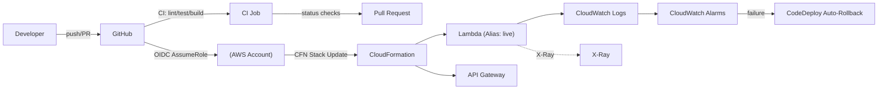
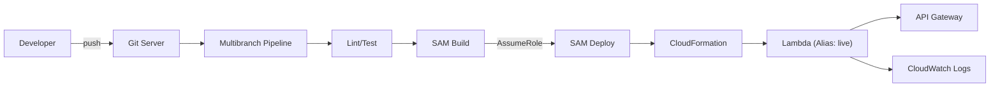

아주 실무적으로, **Python + AWS Lambda 기반 개발에서 CI/CD와 개발 프로세스가 어떤 식으로 진행되는지**를 전체 흐름 기준으로 깔끔하게 정리해줄게.  
Lambda 특성(서버 없음, 빌드 아티팩트=ZIP 배포) 때문에 일반 서버 배포와는 흐름이 꽤 다름.

***

# 🚀 AWS Lambda(Python) 개발 시 전체 흐름 요약

> **핵심 요약**  
> “소스코드 → 의존성 패키징(zip) → S3 업로드 → Lambda 업데이트”  
> 또는  
> “Serverless Framework/SAM/Terraform로 IaC + GitHub Actions로 자동 배포”

***

# 1️⃣ 개발 방식 (로컬 개발)

### 📌 개발/테스트 구조

*   로컬에서 Python 함수 작성
*   테스트는 **pytest**로 수행
*   AWS API 호출은 **boto3** 사용
*   환경 변수는 `.env` 또는 AWS Systems Manager Parameter Store 사용

### 📌 Lambda 구조 예시

    /my-lambda
      ├── handler.py
      ├── requirements.txt
      ├── tests/
      ├── templates/ (SAM/Serverless)

### 📌 로컬에서 Lambda 테스트하는 2가지 방식

1.  **단위 테스트(pytest)**
2.  **SAM CLI 로컬 실행**
    ```bash
    sam local invoke MyFunction --event event.json
    ```

***

# 2️⃣ 필요한 Tool & 스택

## ✔ 필수

| 구분          | 도구                                                        |
| ----------- | --------------------------------------------------------- |
| 버전 관리       | Git                                                       |
| CI/CD       | GitHub Actions, GitLab CI, AWS CodePipeline 등             |
| 패키징         | AWS SAM, Serverless Framework, ZIP + pip install --target |
| IaC(강력히 추천) | AWS SAM, CloudFormation, Terraform                        |
| 테스트         | pytest                                                    |
| 배포 대상       | AWS Lambda + IAM + CloudWatch Logs + API Gateway          |

***

# 3️⃣ Lambda 배포 방식(3가지)

## ✔ 방법 1) **ZIP 파일 직접 빌드 + S3 업로드 + Lambda 업데이트**

가장 단순하며 기본적인 방식

### GitHub Actions Workflow 흐름

1.  코드를 checkout
2.  pip install → 패키징
3.  zip 생성
4.  S3 업로드
5.  Lambda 함수 코드 업데이트

***

## ✔ 방법 2) **AWS SAM(Serverless Application Model)** → 기업에서 가장 많이 씀

SAM은 CloudFormation 기반 IaC로 Lambda App을 표준 방식으로 정의함.

### SAM Template 예시

```yaml
Resources:
  MyLambda:
    Type: AWS::Serverless::Function
    Properties:
      Handler: handler.lambda_handler
      Runtime: python3.11
      Timeout: 30
      CodeUri: ./src
```

### GitHub Actions에서 하는 일

```bash
sam build
sam deploy --no-confirm-changeset
```

장점

*   IaC 기반 관리
*   API Gateway, IAM, EventBridge 등 모두 템플릿 선언
*   롤백 쉬움

***

## ✔ 방법 3) **Serverless Framework**

Lambda + API Gateway + SQS 등 자동화 초강력 도구.

`serverless.yml` 사용.

***

# 4️⃣ CI 단계(CI/CD 파이프라인)

### GitHub Actions 기준(대표적)

## ✔ CI 흐름

1.  **Lint 검사 (black, flake8)**
2.  **Test 수행 (pytest)**
3.  **Packaging 검증** (`sam build` 또는 zip 빌드 확인)
4.  **보안 검사(Optional)** (bandit, safety)
5.  **Merge 조건 체크**

***

# 5️⃣ CD 단계(배포 자동화)

AWS Lambda 배포는 다음 중 하나로 완성됨.

## 🔥 1) SAM 기반 배포 파이프라인 예시

```yaml
name: deploy-lambda

on:
  push:
    branches: [ "main" ]

jobs:
  deploy:
    runs-on: ubuntu-latest
    steps:
      - uses: actions/checkout@v4

      - name: Install AWS SAM CLI
        run: |
          pip install aws-sam-cli

      - name: Build SAM
        run: sam build --use-container

      - name: Deploy to AWS
        run: sam deploy --no-confirm-changeset --stack-name my-lambda-stack
```

***

## 🔥 2) ZIP 방식 배포 예시

```yaml
- name: Install dependencies
  run: pip install -r requirements.txt -t package/

- name: Create ZIP
  run: |
    cd package
    zip -r ../deploy.zip .
    cd ..
    zip -g deploy.zip handler.py

- name: Upload Lambda code
  run: |
    aws lambda update-function-code \
      --function-name my-lambda \
      --zip-file fileb://deploy.zip
```

***

# 6️⃣ Lambda 환경에서 자동 배포할 때 고려해야 할 것

### ✔ 1. 의존성은 반드시 패키징 필요

Lambda는 서버가 없어서  
`pip install` 한 패키지를 **ZIP에 포함해서** 업로드해야 함.

### ✔ 2. Layers 활용

공통 라이브러리를 Lambda Layer에 따로 배포하면

*   ZIP 파일 크기 감소
*   함수 여러 개가 공통 모듈 재사용 가능

### ✔ 3. 환경 변수는 AWS Systems Manager Parameter Store 사용 권장

***

# 7️⃣ 전체 아키텍처 흐름 그림

    [Developer]
         ↓ (Git push)
    [GitHub Actions CI]
      - Lint
      - Test
      - Build ZIP/SAM
         ↓
    [GitHub Actions CD]
      - S3 upload
      - Lambda update
         ↓
    [AWS Lambda]
         ↓
    [API Gateway / EventBridge / SQS …]

***

# 🎯 결론

AWS Lambda(Python) 개발에서 CI/CD는 다음 순서로 진행됨:

1.  **Git Workflow 기반 개발**
2.  **pytest + lint로 품질관리**
3.  **SAM 또는 ZIP 방식으로 코드 패키징**
4.  **GitHub Actions에서 자동 빌드/배포**
5.  **Lambda 코드 업데이트 또는 SAM deploy**
6.  **CloudWatch Logs로 모니터링**

***

원하면 아래처럼도 만들어줄 수 있어:

🔧 GitHub Actions + SAM 기반 **실제 회사에서 바로 쓰는 수준의 템플릿**  
📄 Lambda 기반 API 프로젝트 **개발 표준 문서**  
📦 Lambda ZIP 배포 스크립트  
📐 Lambda + APIGW 아키텍처 다이어그램(Mermaid 포함)

좋아, **“GitHub Actions + AWS SAM 기반”으로 바로 실무 투입 가능한 템플릿**을 한 번에 가져갈 수 있게 리포지토리 구조, 샘플 코드, IaC, CI(검증)·CD(배포) 워크플로우, OIDC 보안 설정까지 **완성형**으로 드릴게.\
(브랜치-환경 매핑, 카나리 배포, 파라미터/시크릿 관리, 관측/알람, 롤백까지 포함)

***
# GitHub Actions + SAM 기반 **실제 회사에서 바로 쓰는 수준의 템플릿**

## 🗂️ 1) 리포지토리 구조 (권장)

    .
    ├── src/
    │   ├── handler.py
    │   └── layers/          # (옵션) 공통 라이브러리 소스
    ├── tests/
    │   └── test_handler.py
    ├── template.yaml        # SAM 템플릿 (IaC)
    ├── samconfig.toml       # 환경별 배포 설정(dev/stg/prod)
    ├── requirements.txt     # 함수 의존성
    ├── layer-requirements.txt   # (옵션) 레이어 의존성
    ├── Makefile
    ├── policies/
    │   └── lambda_execution_policy.json
    ├── scripts/
    │   ├── package-zip.sh   # (옵션) ZIP 빌드 스크립트
    │   └── pre-deploy.sh    # (옵션) 사전 점검/마이그/스키마 등
    └── .github/
        └── workflows/
            ├── ci.yml       # PR/브랜치 CI(린트/테스트/빌드)
            └── deploy.yml   # 브랜치/태그 별 CD(배포)

***

## 🧱 2) SAM 템플릿 (`template.yaml`)

> ✅ 포인트: **API Gateway + Lambda + CloudWatch Logs + X-Ray + 카나리 배포(CodeDeploy)**, **SSM 파라미터/Secrets 연동**, **태깅** 포함

```yaml
AWSTemplateFormatVersion: '2010-09-09'
Transform: AWS::Serverless-2016-10-31
Description: My Serverless API (Python + SAM)

Globals:
  Function:
    Runtime: python3.11
    MemorySize: 256
    Timeout: 15
    Tracing: Active
    LoggingConfig:
      LogFormat: JSON
      ApplicationLogLevel: INFO
      SystemLogLevel: INFO
      LogGroup: !Ref AppLogGroup
    Tags:
      System: Billing
      Service: MyLambdaAPI
      Owner: PlatformTeam
      CostCenter: XYZ123

Parameters:
  Stage:
    Type: String
    AllowedValues: [dev, stg, prod]
    Default: dev
  AppName:
    Type: String
    Default: my-lambda-api
  ArtifactBucketName:
    Type: String
    Description: S3 bucket for SAM artifacts
  ApiThrottlingBurst:
    Type: Number
    Default: 200
  ApiThrottlingRate:
    Type: Number
    Default: 100
  EnableCanary:
    Type: String
    AllowedValues: ['true','false']
    Default: 'true'

Mappings:
  AlarmThresholds:
    dev: { ErrorRate: 5 }
    stg: { ErrorRate: 3 }
    prod:{ ErrorRate: 1 }

Resources:

  # CloudWatch LogGroup (보존기간 30일)
  AppLogGroup:
    Type: AWS::Logs::LogGroup
    Properties:
      LogGroupName: !Sub "/aws/lambda/${AppName}-${Stage}"
      RetentionInDays: 30

  # (옵션) 공통 라이브러리 Layer
  CommonLayer:
    Type: AWS::Serverless::LayerVersion
    Properties:
      LayerName: !Sub "${AppName}-layer-${Stage}"
      ContentUri: src/layers/
      CompatibleRuntimes: [python3.11]
      RetentionPolicy: Delete
      Description: Common utilities for ${AppName}

  # 메인 Lambda
  ApiFunction:
    Type: AWS::Serverless::Function
    Properties:
      FunctionName: !Sub "${AppName}-${Stage}"
      CodeUri: src/
      Handler: handler.lambda_handler
      Layers:
        - !Ref CommonLayer
      Policies:
        - AWSLambdaBasicExecutionRole
        - Version: '2012-10-17'
          Statement:
            - Sid: ParamStoreRead
              Effect: Allow
              Action: ["ssm:GetParameter","ssm:GetParameters","ssm:GetParametersByPath"]
              Resource: !Sub "arn:aws:ssm:${AWS::Region}:${AWS::AccountId}:parameter/${AppName}/${Stage}/*"
            - Sid: SecretsRead
              Effect: Allow
              Action: ["secretsmanager:GetSecretValue"]
              Resource: !Sub "arn:aws:secretsmanager:${AWS::Region}:${AWS::AccountId}:secret:${AppName}/${Stage}/*"
      Environment:
        Variables:
          STAGE: !Ref Stage
          # SSM 파라미터(일반) 예시
          CONFIG_JSON: !Sub '{{resolve:ssm:/\{AppName\}/\{Stage\}/config:1}}'
          # Secrets Manager 예시
          DB_SECRET: !Sub '{{resolve:secretsmanager:${AppName}/${Stage}/db:SecretString}}'
      Events:
        Api:
          Type: Api
          Properties:
            Path: /hello
            Method: GET
            RestApiId: !Ref ApiGateway
      AutoPublishAlias: live
      DeploymentPreference:
        # 카나리 배포(옵션) - EnableCanary 로 on/off
        Enabled: !Equals [!Ref EnableCanary, 'true']
        Type: Canary10Percent5Minutes
        Alarms:
          - !Ref LambdaErrorAlarm
        Hooks: {} # (옵션) 배포 전/후 훅 Lambda 지정 가능

  # API Gateway
  ApiGateway:
    Type: AWS::Serverless::Api
    Properties:
      Name: !Sub "${AppName}-api-${Stage}"
      StageName: !Ref Stage
      TracingEnabled: true
      MethodSettings:
        - ResourcePath: "/*"
          HttpMethod: "*"
          ThrottlingBurstLimit: !Ref ApiThrottlingBurst
          ThrottlingRateLimit: !Ref ApiThrottlingRate
          DataTraceEnabled: false
          MetricsEnabled: true

  # 알람 (에러율)
  LambdaErrorAlarm:
    Type: AWS::CloudWatch::Alarm
    Properties:
      AlarmName: !Sub "${AppName}-${Stage}-LambdaErrorRate"
      Namespace: "AWS/Lambda"
      MetricName: "Errors"
      Dimensions:
        - Name: FunctionName
          Value: !Ref ApiFunction
      Statistic: Sum
      Period: 60
      EvaluationPeriods: 1
      Threshold: !FindInMap [AlarmThresholds, !Ref Stage, ErrorRate]
      ComparisonOperator: GreaterThanOrEqualToThreshold
      TreatMissingData: notBreaching

Outputs:
  ApiUrl:
    Description: API Base URL
    Value: !Sub "https://${ApiGateway}.execute-api.${AWS::Region}.amazonaws.com/${Stage}"
  FunctionName:
    Value: !Ref ApiFunction
```

> 🔎 필요한 리소스 더 있으면(Dead Letter Queue, VPC, SQS/SNS, EventBridge) `Properties`에 추가 확장하면 됩니다.

***

## ⚙️ 3) 환경별 배포 설정 (`samconfig.toml`)

> **브랜치-환경 매핑** 예시:\
> `develop` → dev, `release/*` → stg, `main`/태그 → prod

```toml
version = 0.1

[default]
[default.global.parameters]
stack_name = "my-lambda-api"
region = "ap-northeast-2"
s3_bucket = "my-sam-artifacts-apne2"

[dev.deploy.parameters]
parameter_overrides = [
  "Stage=dev",
  "AppName=my-lambda-api",
  "ArtifactBucketName=my-sam-artifacts-apne2",
  "EnableCanary=true"
]
capabilities = "CAPABILITY_IAM"

[stg.deploy.parameters]
parameter_overrides = [
  "Stage=stg",
  "AppName=my-lambda-api",
  "ArtifactBucketName=my-sam-artifacts-apne2",
  "EnableCanary=true"
]
capabilities = "CAPABILITY_IAM"

[prod.deploy.parameters]
parameter_overrides = [
  "Stage=prod",
  "AppName=my-lambda-api",
  "ArtifactBucketName=my-sam-artifacts-apne2",
  "EnableCanary=true"
]
capabilities = "CAPABILITY_IAM"
```

***

## 🐍 4) 함수 코드 (`src/handler.py`)

> **구조화 로깅 + 방어적 검증 + 포맷 고정** (aws-lambda-powertools 권장)

```python
import json
import os
from aws_lambda_powertools import Logger, Metrics, Tracer

logger = Logger(service=os.getenv("AppName", "my-lambda-api"))
metrics = Metrics(namespace="MyLambdaAPI")
tracer = Tracer(service="my-lambda-api")

@tracer.capture_lambda_handler
def lambda_handler(event, context):
    logger.append_keys(stage=os.getenv("STAGE", "dev"))

    # 간단한 유효성 체크
    if "httpMethod" in event and event.get("httpMethod") != "GET":
        logger.warning("Method not allowed", method=event.get("httpMethod"))
        return {
            "statusCode": 405,
            "headers": {"Content-Type": "application/json"},
            "body": json.dumps({"message": "Method Not Allowed"})
        }

    name = (event.get("queryStringParameters") or {}).get("name", "world")
    body = {"message": f"Hello, {name}!"}

    logger.info("Request handled", extra={"name": name})
    metrics.add_metric(name="RequestCount", unit="Count", value=1)

    return {
        "statusCode": 200,
        "headers": {"Content-Type": "application/json"},
        "body": json.dumps(body)
    }
```

**requirements.txt**

    aws-lambda-powertools

***

## ✅ 5) 테스트 코드 (`tests/test_handler.py`)

```python
import json
from src.handler import lambda_handler

def test_hello_ok():
    event = {"httpMethod": "GET", "queryStringParameters": {"name": "Gangil"}}
    res = lambda_handler(event, None)
    assert res["statusCode"] == 200
    body = json.loads(res["body"])
    assert body["message"] == "Hello, Gangil!"

def test_method_not_allowed():
    event = {"httpMethod": "POST"}
    res = lambda_handler(event, None)
    assert res["statusCode"] == 405
```

***

## 🧪 6) Makefile (로컬 표준화된 명령)

```makefile
PY=python3

init:
\t$(PY) -m pip install --upgrade pip
\t$(PY) -m pip install -r requirements.txt -r layer-requirements.txt -r requirements-dev.txt || true

test:
\tpytest -q --disable-warnings

lint:
\tblack --check .
\tflake8 .

sam-build:
\tsam build --use-container

sam-deploy-dev:
\tsam deploy --config-env dev --no-confirm-changeset --no-fail-on-empty-changeset

sam-deploy-stg:
\tsam deploy --config-env stg --no-confirm-changeset --no-fail-on-empty-changeset

sam-deploy-prod:
\tsam deploy --config-env prod --no-confirm-changeset --no-fail-on-empty-changeset
```

> `requirements-dev.txt` 예시: `pytest`, `black`, `flake8`

***

## 🔐 7) GitHub Actions OIDC로 AWS 권한 위임 (보안 필수)

### (A) AWS 측: GitHub OIDC 신뢰 정책 (IAM Role Trust Policy)

> **배포용 IAM Role**을 하나 만들고(예: `MyCICDRole`) 아래 트러스트 정책으로 GitHub 워크플로우에서 OIDC로 **임시 크리덴셜** 발급받게 합니다.\
> (리포/브랜치/환경에 맞춰 `sub` 조건값 꼭 변경)

```json
{
  "Version": "2012-10-17",
  "Statement": [
    {
      "Sid": "GitHubOIDCTrust",
      "Effect": "Allow",
      "Principal": {
        "Federated": "arn:aws:iam::<ACCOUNT_ID>:oidc-provider/token.actions.githubusercontent.com"
      },
      "Action": "sts:AssumeRoleWithWebIdentity",
      "Condition": {
        "StringEquals": {
          "token.actions.githubusercontent.com:aud": "sts.amazonaws.com"
        },
        "StringLike": {
          "token.actions.githubusercontent.com:sub": "repo:<ORG_OR_USER>/<REPO>:ref:refs/heads/*"
        }
      }
    }
  ]
}
```

### (B) 배포 Role 권한(예시)

*   CloudFormation/S3/Lambda/APIGW/SSM/Secrets 필요한 최소 권한 부여(원칙적으로는 **least privilege**로 좁히세요)

```json
{
  "Version": "2012-10-17",
  "Statement": [
    {"Effect":"Allow","Action":["cloudformation:*"],"Resource":"*"},
    {"Effect":"Allow","Action":["s3:*"],"Resource":"*"},
    {"Effect":"Allow","Action":["lambda:*"],"Resource":"*"},
    {"Effect":"Allow","Action":["apigateway:*"],"Resource":"*"},
    {"Effect":"Allow","Action":["ssm:Get*","secretsmanager:Get*"],"Resource":"*"},
    {"Effect":"Allow","Action":["iam:PassRole"],"Resource":"*"}
  ]
}
```

> 실제 운영에서는 스택/버킷/리소스 ARN 단위로 리소스 범위를 제한하세요.

***

## 🤖 8) GitHub Actions – CI (`.github/workflows/ci.yml`)

> PR/브랜치에서 **린트/테스트/SAM 빌드 검증**만 수행.\
> Python 캐시, 병렬 매트릭스(필요시) 포함.

```yaml
name: CI

on:
  pull_request:
    branches: [ "develop", "main", "release/*" ]
  push:
    branches: [ "develop" ]

jobs:
  build-test:
    runs-on: ubuntu-latest
    steps:
      - uses: actions/checkout@v4

      - name: Setup Python
        uses: actions/setup-python@v5
        with:
          python-version: "3.11"
          cache: "pip"

      - name: Install dev deps
        run: |
          pip install --upgrade pip
          pip install -r requirements.txt
          pip install pytest black flake8 aws-sam-cli

      - name: Lint
        run: |
          black --check .
          flake8 .

      - name: Test
        run: pytest -q

      - name: SAM Build
        run: sam build --use-container
```

***

## 🚀 9) GitHub Actions – CD (`.github/workflows/deploy.yml`)

> **브랜치/태그 → 환경 매핑** & **OIDC로 AssumeRole** & **sam deploy**\
> GitHub **Environments**로 보호 규칙(승인/시간 제한)도 걸 수 있습니다.

```yaml
name: Deploy

on:
  push:
    branches:
      - develop
      - main
      - 'release/*'
    tags:
      - 'v*.*.*'

env:
  AWS_REGION: ap-northeast-2
  APP_NAME: my-lambda-api
  ARTIFACT_BUCKET: my-sam-artifacts-apne2

jobs:
  deploy:
    runs-on: ubuntu-latest
    strategy:
      matrix:
        include:
          - branch: develop
            envName: dev
            awsRoleArn: arn:aws:iam::<ACCOUNT_ID>:role/MyCICDRole-Dev
            ghEnv: dev
          - branch: main
            envName: prod
            awsRoleArn: arn:aws:iam::<ACCOUNT_ID>:role/MyCICDRole-Prod
            ghEnv: prod
    if: |
      startsWith(github.ref, 'refs/heads/' + matrix.branch) ||
      (startsWith(github.ref, 'refs/tags/') && matrix.branch == 'main')
    environment: ${{ matrix.ghEnv }}

    steps:
      - uses: actions/checkout@v4

      - name: Setup Python
        uses: actions/setup-python@v5
        with:
          python-version: "3.11"
          cache: "pip"

      - name: Install SAM CLI
        run: |
          pip install --upgrade pip
          pip install aws-sam-cli

      - name: Configure AWS Credentials (OIDC)
        uses: aws-actions/configure-aws-credentials@v4
        with:
          aws-region: ${{ env.AWS_REGION }}
          role-to-assume: ${{ matrix.awsRoleArn }}
          role-session-name: gha-sam-deploy

      - name: SAM Build
        run: sam build --use-container

      - name: SAM Deploy
        run: |
          sam deploy \
            --stack-name ${{ env.APP_NAME }}-${{ matrix.envName }} \
            --s3-bucket ${{ env.ARTIFACT_BUCKET }} \
            --parameter-overrides Stage=${{ matrix.envName }} AppName=${{ env.APP_NAME }} ArtifactBucketName=${{ env.ARTIFACT_BUCKET }} EnableCanary=true \
            --capabilities CAPABILITY_IAM \
            --no-confirm-changeset \
            --no-fail-on-empty-changeset

      - name: Output API URL
        run: |
          aws cloudformation describe-stacks --stack-name ${{ env.APP_NAME }}-${{ matrix.envName }} \
            --query "Stacks[0].Outputs[?OutputKey=='ApiUrl'].OutputValue" --output text
```

> \*\*staging 환경(release/\*)\*\*도 위 matrix에 추가하세요.

***

## 🔎 10) 파라미터 & 비밀(SSM / Secrets Manager) 운영

*   SSM Parameter Store: `/my-lambda-api/dev/config` 같은 계층적 키로 운영
*   Secrets Manager: `/my-lambda-api/dev/db`에 JSON 형태(예: `{"user":"...","password":"...","host":"..."}`) 저장
*   SAM 템플릿에서 **Dynamic reference**로 가져오고, **권한은 함수 Role 또는 배포 Role**에서 최소권한으로 부여

***

## 📈 11) 관측/알람/배포 안정성

*   **Powertools**로 구조화 로깅/메트릭/트레이싱 일원화
*   **CloudWatch Alarm**: 에러율/지연시간, API 5XX 비율 추가 가능
*   **카나리 배포** + 알람 연동으로 문제 시 **자동 롤백**
*   배포 파이프라인에 **환경 보호 규칙(Approver)** 걸어 운영 안정성 강화

***

## 🧩 12) (옵션) 레이어 의존성

`layer-requirements.txt`에 공통 패키지 기재 후, 빌드 시 `pip install -r layer-requirements.txt -t src/layers/python` 형태로 구성하면 레이어 크기 줄이기/공유에 유리.

***

## 🗺️ 13) 파이프라인/아키텍처 흐름 (Mermaid)

> 사용자 취향에 맞춰 **간결 문법**으로 준비


***

## 🏁 14) 빠른 시작(운영 절차)

1.  **S3 아티팩트 버킷 생성**: `my-sam-artifacts-apne2`
2.  **IAM Role (Dev/Prod 등) 1개씩 생성**
    *   GitHub OIDC 신뢰 정책 + 최소권한 정책 연결
3.  **GitHub → Environments(dev/prod)** 생성(필요 시 Approver 지정)
4.  **리포에 템플릿 반영** → `develop` 브랜치 푸시 → CI 통과 확인
5.  `develop` 푸시 시 **dev 자동 배포**, `main`/태그 시 **prod 배포**
6.  `sam delete`로 스택 제거 가능(주의)

***

## 🔧 15) 실무 팁

*   **monorepo**라면 각 함수 디렉터리마다 `template.yaml` 분리하거나, 상위 템플릿에서 `AWS::Serverless::Application`으로 서브스택 분리
*   콜드스타트 민감하면 **메모리 256→512MB**로 올려 지연/비용 균형 조절
*   **에러/타임아웃**은 CloudWatch Logs + Alarm으로 즉시 감지
*   **버전 고정**: `pip-tools`(compile), Dependabot로 주기적 업데이트
*   **배포 시간 단축**: `sam build --cached` + Python 캐시 + 레이어 활용

***

필요하면 이 템플릿을 **zip 형태로 패키징**해서 드리거나,\
**회사 표준 문서(Confluence/Notion 템플릿)** 포맷으로도 변환해줄게.

원하시는 **브랜치-환경 매핑**(예: `feature/*` → ephemeral 환경), VPC 연결, Private API, WAF, R53 커스텀 도메인, ALB 통합 등도 바로 확장해드릴 수 있어.\
어떤 변형이 필요해? (ex. VPC 연결, DB 접근, 다중 스테이지, 별도 승인 단계 등)

짧게 답하면: **여전히 많이 씁니다.**\
다만 “신규 녹색필드”나 “퍼블릭 리포 중심(예: GitHub/GitLab)” 팀은 **GitHub Actions/GitLab CI로 이동**하는 흐름이 확실하고, **사내망/보안·규제/온프레미스** 중심 팀은 **Jenkins를 계속 주력**으로 씁니다. 즉 **환경과 요구사항**에 따라 최적 선택이 갈립니다.

아래에 **언제 Jenkins가 유리한지**, **언제 Actions/SAM이 유리한지**, 그리고 **Lambda(SAM) 기준 Jenkins 템플릿**까지 실전형으로 정리했어요.

***

## ✅ Jenkins가 “더” 적합한 경우

*   **사내망/폐쇄망/규제 환경**: 인터넷 차단, SaaS 금지, 아티팩트 프록시만 허용되는 환경
*   **온프레미스/하이브리드**: 사내 Git/SVN, Nexus/Artifactory, 사내 쿠버네티스/VM 배포 중심
*   **복잡한 멀티리포/모놀리포**: 팬아웃/팬인, 의존성 그래프에 따른 동적 파이프라인
*   **플러그인/에이전트 커스터마이징**: 특수 빌드 도구, 자체 보안 스캐너, 사내용 툴 통합
*   **긴 배치/병렬 대량 작업**: 대규모 에이전트 풀, 커스텀 autoscaling

> 반대로 \*\*Jenkins 운영 부담(업그레이드/플러그인 호환/보안패치/백업/스케일링)\*\*은 계속 존재합니다. 전담 운영 없이 쓰기엔 장기적으로 비용이 커질 수 있어요.

***

## ✅ GitHub Actions(또는 GitLab CI)가 유리한 경우

*   **SaaS 허용 / 퍼블릭 Git 활용**: 러닝커브 낮고 관리부담 적음
*   **IaC 및 클라우드 네이티브**: OIDC 기반 권한 위임, 캐시/매트릭스/환경 보호규칙 등 기본 제공
*   **개발자 경험(DX)**: Marketplace 액션, 손쉬운 시크릿/환경 관리, 빠른 세팅
*   **Lambda/SAM/Serverless**: 샘플과 베스트 프랙티스가 풍부, 배포 속도 빠름

***

## 🔁 “공존” 패턴 (Jenkins + Actions/SAM 같이 쓰기)

*   **소스=GitHub, 빌드/배포=Jenkins**: GitHub webhook → Jenkins Multibranch Pipeline → 빌드/배포
*   **CI=GitHub Actions, CD=Jenkins**: Actions이 아티팩트 업로드 후 Jenkins에 **POST 트리거**(예: 특정 환경 배포는 Jenkins가 담당)
*   **단계별 분담**: 보안 스캔/패키징은 Jenkins, 최종 **SAM deploy는 Actions**(OIDC) 등

> 기존 Jenkins 자산이 크면 **점진적 분리**가 현실적입니다. 신규 서비스는 Actions, 레거시는 Jenkins 유지 → 점차 전환.

***

## 🧱 Jenkins에서 AWS Lambda(SAM) 배포 – 실전 템플릿

### 1) 권장 플러그인

*   **Pipeline (Declarative/Multibranch)**, **Git**, **Credentials Binding**, **Git Parameter**
*   **JUnit**, **Warnings Next Generation**, **AnsiColor**, **Timestamper**
*   (옵션) **Configuration as Code(JCasC)**, **Job DSL**, **Matrix**, **SSH Agent**
*   (AWS) **AWS Credentials** 또는 CLI 사전설치/AssumeRole 전략

> GitHub 연동이면 **GitHub Branch Source**, GitLab이면 **GitLab Plugin**도 추가.

***

### 2) Jenkins 에이전트 전략

*   **Docker 에이전트** 권장: `awscli`, `aws-sam-cli`, `python3.11`, `pip`, `zip`, `jq` 포함된 사내용 베이스 이미지
*   또는 **EC2/VM 에이전트**에 사전 설치 + 캐시 디렉터리 마운트

***

### 3) 크리덴셜/권한 설계

*   **가장 안전**: Jenkins 에이전트가 **EC2 IAM Role**(Instance Profile)로 실행 → `aws sts assume-role`로 **배포용 Role** 전환
*   폐쇄망이면 **Access Key/Secret**을 Jenkins Credentials에 등록(보안·순환 정책 필수)
*   OIDC는 Jenkins도 가능하지만 운영 복잡도가 높아 실무에선 **EC2 Role + AssumeRole**이 깔끔합니다.

***

### 4) 브랜치 → 환경 매핑 예시

*   `develop` → `dev`
*   `release/*` → `stg`
*   `main`/태그 → `prod`

분기 로직은 Jenkinsfile에서 `BRANCH_NAME` 기준으로 처리.

***

### 5) **Jenkinsfile (Declarative) – SAM 배포 파이프라인 예시**

```groovy
pipeline {
  agent {
    // 사내용 베이스 이미지: awscli, sam-cli, python3.11, zip, jq 포함
    docker { image 'registry.local/ci/python-aws-sam:3.11' args '-u root:root' }
  }
  options {
    ansiColor('xterm')
    timestamps()
    buildDiscarder(logRotator(numToKeepStr: '50'))
    disableConcurrentBuilds()
    timeout(time: 30, unit: 'MINUTES')
  }
  environment {
    AWS_REGION = 'ap-northeast-2'
    APP_NAME   = 'my-lambda-api'
    ARTIFACT_BUCKET = 'my-sam-artifacts-apne2'
    // Jenkins Credentials ID (Access Key/Secret) 사용하는 경우:
    // AWS_ACCESS_KEY_ID     = credentials('aws-access-key-id')
    // AWS_SECRET_ACCESS_KEY = credentials('aws-secret-access-key')
  }
  stages {

    stage('Checkout') {
      steps {
        checkout scm
        sh 'git --version'
      }
    }

    stage('Setup Python & Deps') {
      steps {
        sh '''
          python3 --version
          pip3 install --upgrade pip
          pip3 install -r requirements.txt
          pip3 install pytest black flake8 aws-sam-cli
        '''
      }
    }

    stage('Lint') {
      steps { sh 'black --check . && flake8 .' }
    }

    stage('Test') {
      steps {
        sh 'pytest -q --disable-warnings --junitxml=reports/junit.xml'
      }
      post {
        always {
          junit 'reports/junit.xml'
        }
      }
    }

    stage('Resolve Env') {
      steps {
        script {
          // 브랜치 기준 환경 매핑
          def envName = 'dev'
          if (env.BRANCH_NAME == 'main' || env.BRANCH_NAME.startsWith('tags/')) envName = 'prod'
          else if (env.BRANCH_NAME.startsWith('release/')) envName = 'stg'
          env.DEPLOY_ENV = envName
          echo "Deploy Environment = ${env.DEPLOY_ENV}"
        }
      }
    }

    stage('AssumeRole (Optional)') {
      when { expression { return env.DEPLOY_ENV in ['stg','prod'] } }
      steps {
        // EC2 Instance Profile이 붙은 에이전트에서 배포용 Role을 전환하는 패턴
        sh '''
          ROLE_ARN="arn:aws:iam::<ACCOUNT_ID>:role/MyCICDRole-${DEPLOY_ENV^}" # Dev/Prod 등 케이스
          CREDS=$(aws sts assume-role --role-arn "$ROLE_ARN" --role-session-name jenkins-sam --duration-seconds 3600)
          export AWS_ACCESS_KEY_ID=$(echo $CREDS | jq -r .Credentials.AccessKeyId)
          export AWS_SECRET_ACCESS_KEY=$(echo $CREDS | jq -r .Credentials.SecretAccessKey)
          export AWS_SESSION_TOKEN=$(echo $CREDS | jq -r .Credentials.SessionToken)
          aws sts get-caller-identity
        '''
      }
    }

    stage('SAM Build') {
      steps {
        sh 'sam build --use-container'
      }
    }

    stage('SAM Deploy') {
      steps {
        sh '''
          sam deploy \
            --stack-name ${APP_NAME}-${DEPLOY_ENV} \
            --s3-bucket ${ARTIFACT_BUCKET} \
            --parameter-overrides Stage=${DEPLOY_ENV} AppName=${APP_NAME} ArtifactBucketName=${ARTIFACT_BUCKET} EnableCanary=true \
            --capabilities CAPABILITY_IAM \
            --no-confirm-changeset \
            --no-fail-on-empty-changeset \
            --region ${AWS_REGION}
        '''
      }
    }

    stage('Outputs') {
      steps {
        sh '''
          aws cloudformation describe-stacks --stack-name ${APP_NAME}-${DEPLOY_ENV} \
            --query "Stacks[0].Outputs[?OutputKey=='ApiUrl'].OutputValue" --output text --region ${AWS_REGION} || true
        '''
      }
    }
  }

  post {
    always {
      archiveArtifacts artifacts: 'reports/**/*.xml', allowEmptyArchive: true
    }
    failure {
      echo 'Build/Deploy failed. Please check logs and alarms.'
    }
  }
}
```

> 위 Jenkinsfile은 **SAM 기반 배포**를 Jenkins에서 안정적으로 수행하는 표준 패턴입니다.\
> (EC2 Role + AssumeRole / AccessKey 방식 둘 다 대응)

***

## 📊 간단 흐름(사용자 선호 Mermaid)



***

## 🧩 운영 팁

*   **Job as Code**: Jenkins Configuration as Code(JCasC)로 파이프라인/플러그인/크리덴셜 선언형 관리
*   **공유 라이브러리**: `vars/`로 사내 표준 Stage(예: `runSamDeploy(env)`) 만들어 재사용
*   **에이전트 자동 확장**: Kubernetes Plugin으로 빌드 팟 on-demand 생성
*   **보안**: 플러그인 업데이트/백업 자동화, 최소 권한 Role, 크리덴셜 회전 주기
*   **피쳐 환경**: PR/feature 브랜치에 **ephemeral 스택** 생성 후 머지 시 `sam delete`로 정리(비용 주의)

***

## 결론

*   **Jenkins는 지금도 “많이” 쓰입니다.** 특히 **사내망/규제/온프레미스** 중심에선 메인입니다.
*   **Lambda + SAM** 업무가 많고, **SaaS 허용/클라우드 네이티브**라면 **GitHub Actions**가 운영 편의성·보안(OIDC)·DX 면에서 더 좋습니다.
*   레거시 자산이 크면 **Jenkins와 공존** → **점진 전환**이 현실적인 전략입니다.

필요하시면 위 Jenkinsfile을 **귀사 표준 플러그인/에이전트/권한 모델**에 맞춰 커스터마이징해서 드릴게요.

*   (예) Nexus 연동, 내부 PyPI 프록시, WAF/R53/Private API, VPC Subnet/SG, CodeDeploy 알람 연동 등.\
    어떤 제약(망, 계정 구조, 보안정책)이 있는지 알려주시면 바로 맞춰 드리겠습니다.
